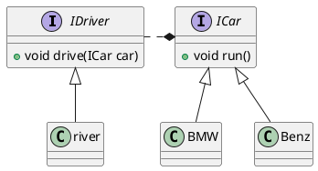

# 依赖导倒置原则

## 原则的定义

- 高层模块不应该依赖底层模块，两者都应该依赖其依赖；
  - 底层模块就是原子模块，原子模块的再组装就是高层模块
- 抽象不应该依赖细节
- 细节应该依赖抽象
  - 细节就是接口的实现类or继承抽象类而产生的类 ，特点就是可以被实例化

### java中的表现(OOD)

-  模块之间的通过接口或者抽象类交互，实现类之间不发生直接的依赖关系，其依赖关系示通过接口或抽象类产生的
- 接口或抽象类不依赖于实现类
- 实现类依赖接口或抽象类

###  示例图

## 依赖的三种写法
- 构造函数传递依赖对象
- setter方法传递依赖对象
- 接口声明依赖对象

## 最佳实践
> 依赖倒置原则通过抽象（接口、抽象类）来使各个类或模块实现彼此独立，不互相影响，实现模块间的松耦合
### 具体做法
- 每个类尽量都要有接口或者抽象类，或者抽象类和接口两者都兼备
- 变量的表面类型**尽量**是接口或者抽象类
- 任何类都不应该从具体类派生
- 尽量不要覆写基类的方法
    - 如果基类是一个抽象类，而且这类已经实现了，子类尽量不要覆写。
    - 类间依赖的是抽象，覆写了抽象方法，对依赖的稳定性产生一定的影响
- 结合历史替换原则使用
